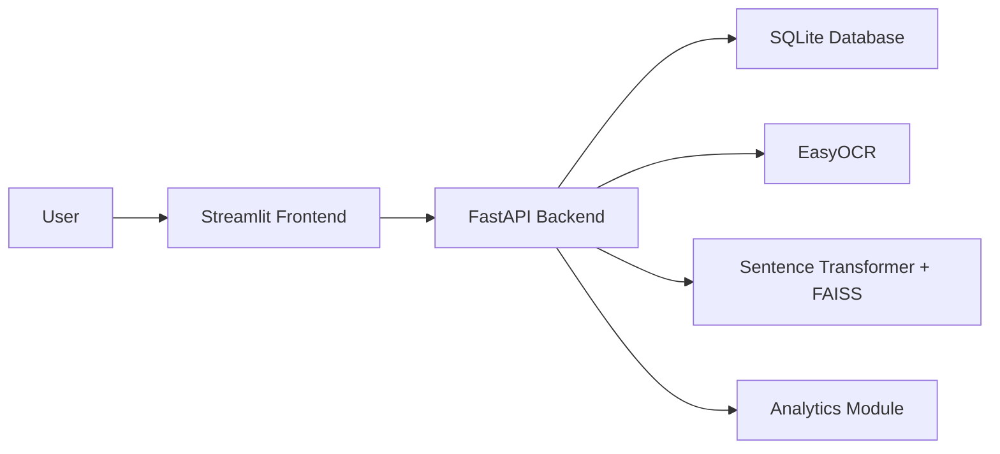
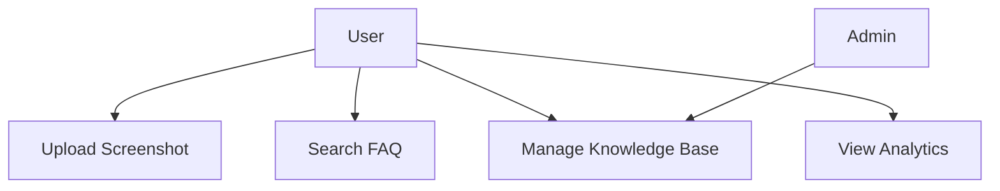
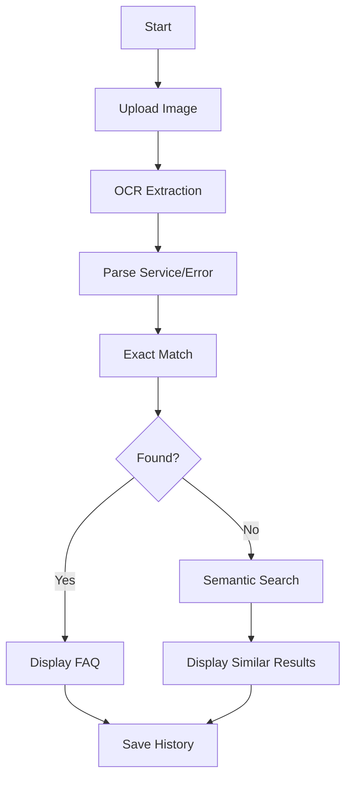
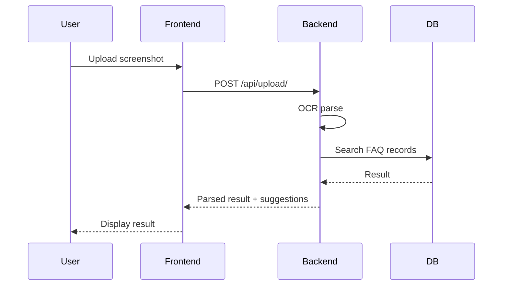
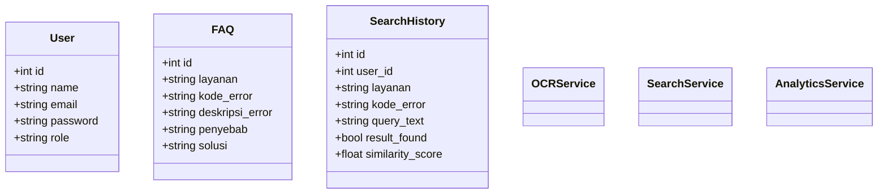

# System Diagrams

## System Architecture

```mermaid
flowchart LR
    A[User] --> B[Streamlit Frontend]
    B --> C[FastAPI Backend]
    C --> D[SQLite Database]
    C --> E[EasyOCR]
    C --> F[Sentence Transformer + FAISS]
    C --> G[Analytics Module]
```

## Use Case Diagram

```mermaid
flowchart TD
    U[User] --> UC1[Upload Screenshot]
    U --> UC2[Search FAQ]
    U --> UC3[Manage Knowledge Base]
    U --> UC4[View Analytics]
    A[Admin] --> UC3
```

## Activity Diagram

```mermaid
flowchart TD
    A[Start] --> B[Upload Image]
    B --> C[OCR Extraction]
    C --> D[Parse Service/Error]
    D --> E[Exact Match]
    E --> F{Found?}
    F -- Yes --> G[Display FAQ]
    F -- No --> H[Semantic Search]
    H --> I[Display Similar Results]
    G --> J[Save History]
    I --> J
```

## Sequence Diagram

```mermaid
sequenceDiagram
    participant U as User
    participant F as Frontend
    participant B as Backend
    participant D as DB
    U->>F: Upload screenshot
    F->>B: POST /api/upload/
    B->>B: OCR parse
    B->>D: Search FAQ records
    D-->>B: Result
    B-->>F: Parsed result + suggestions
    F-->>U: Display result
```

## Class Diagram

```mermaid
classDiagram
    class User {
        +int id
        +string name
        +string email
        +string password
        +string role
    }
    class FAQ {
        +int id
        +string layanan
        +string kode_error
        +string deskripsi_error
        +string penyebab
        +string solusi
    }
    class SearchHistory {
        +int id
        +int user_id
        +string layanan
        +string kode_error
        +string query_text
        +bool result_found
        +float similarity_score
    }
    class OCRService {}
    class SearchService {}
    class AnalyticsService {}
```
