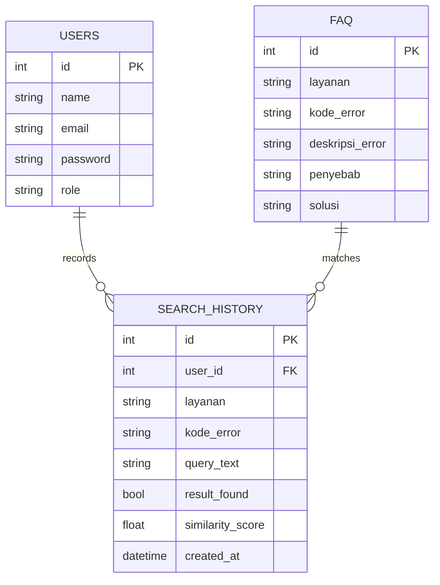

# ERD

```mermaid
erDiagram
    USERS ||--o{ SEARCH_HISTORY : records
    FAQ ||--o{ SEARCH_HISTORY : matches

    USERS {
        int id PK
        string name
        string email
        string password
        string role
    }

    FAQ {
        int id PK
        string layanan
        string kode_error
        string deskripsi_error
        string penyebab
        string solusi
    }

    SEARCH_HISTORY {
        int id PK
        int user_id FK
        string layanan
        string kode_error
        string query_text
        bool result_found
        float similarity_score
        datetime created_at
    }
```
